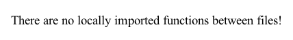

# Repository Analysis

**Total Files:** **366**  
**Total Directories:** **48**  

## File Types
| File Type | Number of Files | Percentage Overall |
| --- | --- | --- |
| **.txt** | 4 | 1.09% |
| **.md** | 33 | 9.02% |
| **** | 7 | 1.91% |
| **.cff** | 1 | 0.27% |
| **.py** | 271 | 74.04% |
| **.toml** | 16 | 4.37% |
| **.diff** | 4 | 1.09% |
| **.out** | 1 | 0.27% |
| **.pie** | 2 | 0.55% |
| **.pyi** | 2 | 0.55% |
| **.ipynb** | 6 | 1.64% |
| **.vim** | 2 | 0.55% |
| **.cfg** | 4 | 1.09% |
| **.ini** | 3 | 0.82% |
| **.png** | 4 | 1.09% |
| **.svg** | 2 | 0.55% |
| **.bat** | 1 | 0.27% |
| **.yml** | 1 | 0.27% |
| **.json** | 1 | 0.27% |
| **.typed** | 1 | 0.27% |

## Directory Structure
```
+-- 📦 black
|   +-- 📁 💻 test_requirements.txt
|   +-- 📁 📃 AUTHORS.md
|   +-- 📁 💻 LICENSE
|   +-- 📁 💻 Dockerfile
|   +-- 📁 💻 CITATION.cff
|   +-- 📁 💻 pyproject.toml
|   +-- 📁 🖼️ local_imports.png
|   +-- 📁 📃 README.md
|   +-- 📁 📃 CONTRIBUTING.md
|   +-- 📁 💻 tox.ini
|   +-- 📁 📃 git_documentation.md
|   +-- 📁 📃 CHANGES.md
|   +-- 📁 🖼️ uml.png
|   +-- 📁 📃 SECURITY.md
|   +-- 📁 💻 action.yml
    +-- 📦 gallery
    |   +-- 📁 💻 Dockerfile
    |   +-- 📁 📃 README.md
    |   +-- 📁 🐍 gallery.py
    +-- 📦 tests
    |   +-- 📁 🐍 test_ranges.py
    |   +-- 📁 🐍 conftest.py
    |   +-- 📁 🐍 optional.py
    |   +-- 📁 🐍 test_trans.py
    |   +-- 📁 🐍 util.py
    |   +-- 📁 🐍 test_docs.py
    |   +-- 📁 🐍 test_ipynb.py
    |   +-- 📁 🐍 __init__.py
    |   +-- 📁 🐍 test_schema.py
    |   +-- 📁 💻 empty.toml
    |   +-- 📁 🐍 test_black.py
    |   +-- 📁 🐍 test_no_ipynb.py
    |   +-- 📁 🐍 test_blackd.py
    |   +-- 📁 🐍 test_format.py
    |   +-- 📁 💻 test.toml
        +-- 📦 data
        |   +-- 📁 💻 invalid_line_ranges.toml
        |   +-- 📁 💻 empty_pyproject.toml
        |   +-- 📁 💻 incorrect_spelling.toml
            +-- 📦 project_metadata
            |   +-- 📁 💻 both_pyproject.toml
            |   +-- 📁 💻 only_metadata_pyproject.toml
            |   +-- 📁 💻 only_black_pyproject.toml
            |   +-- 📁 💻 neither_pyproject.toml
            +-- 📦 ignore_subfolders_gitignore_tests
            |   +-- 📁 🐍 a.py
                +-- 📦 subdir
                |   +-- 📁 🐍 b.py
                    +-- 📦 subdir
                    |   +-- 📁 🐍 c.py
            +-- 📦 cases
            |   +-- 📁 🐍 comments8.py
            |   +-- 📁 🐍 line_ranges_outside_source.py
            |   +-- 📁 🐍 parenthesized_context_managers.py
            |   +-- 📁 🐍 fmtskip5.py
            |   +-- 📁 🐍 line_ranges_exceeding_end.py
            |   +-- 📁 🐍 preview_comments7.py
            |   +-- 📁 🐍 split_delimiter_comments.py
            |   +-- 📁 🐍 comment_after_escaped_newline.py
            |   +-- 📁 🐍 context_managers_autodetect_310.py
            |   +-- 📁 🐍 line_ranges_imports.py
            |   +-- 📁 🐍 multiline_consecutive_open_parentheses_ignore.py
            |   +-- 📁 🐍 pattern_matching_simple.py
            |   +-- 📁 🐍 module_docstring_4.py
            |   +-- 📁 🐍 fmtonoff3.py
            |   +-- 📁 🐍 async_stmts.py
            |   +-- 📁 🐍 py310_pep572.py
            |   +-- 📁 🐍 bytes_docstring.py
            |   +-- 📁 🐍 fstring.py
            |   +-- 📁 🐍 docstring_no_string_normalization.py
            |   +-- 📁 🐍 f_docstring.py
            |   +-- 📁 🐍 percent_precedence.py
            |   +-- 📁 🐍 preview_cantfit.py
            |   +-- 📁 🐍 tupleassign.py
            |   +-- 📁 🐍 allow_empty_first_line.py
            |   +-- 📁 🐍 attribute_access_on_number_literals.py
            |   +-- 📁 🐍 preview_long_dict_values.py
            |   +-- 📁 🐍 context_managers_autodetect_311.py
            |   +-- 📁 🐍 composition_no_trailing_comma.py
            |   +-- 📁 🐍 line_ranges_fmt_off.py
            |   +-- 📁 🐍 type_comment_syntax_error.py
            |   +-- 📁 🐍 fmtonoff2.py
            |   +-- 📁 🐍 preview_hug_parens_with_braces_and_square_brackets.py
            |   +-- 📁 🐍 funcdef_return_type_trailing_comma.py
            |   +-- 📁 🐍 comment_type_hint.py
            |   +-- 📁 🐍 docstring_no_extra_empty_line_before_eof.py
            |   +-- 📁 🐍 comments9.py
            |   +-- 📁 🐍 remove_parens.py
            |   +-- 📁 🐍 raw_docstring_no_string_normalization.py
            |   +-- 📁 🐍 preview_long_strings__type_annotations.py
            |   +-- 📁 🐍 pep_572_py310.py
            |   +-- 📁 🐍 return_annotation_brackets.py
            |   +-- 📁 🐍 module_docstring_1.py
            |   +-- 📁 🐍 fmtskip4.py
            |   +-- 📁 🐍 form_feeds.py
            |   +-- 📁 🐍 keep_newline_after_match.py
            |   +-- 📁 🐍 prefer_rhs_split.py
            |   +-- 📁 🐍 context_managers_autodetect_38.py
            |   +-- 📁 🐍 numeric_literals.py
            |   +-- 📁 🐍 fmtonoff.py
            |   +-- 📁 🐍 comments2.py
            |   +-- 📁 🐍 context_managers_39.py
            |   +-- 📁 🐍 preview_long_strings.py
            |   +-- 📁 🐍 pattern_matching_with_if_stmt.py
            |   +-- 📁 🐍 module_docstring_followed_by_class.py
            |   +-- 📁 🐍 bracketmatch.py
            |   +-- 📁 🐍 pattern_matching_trailing_comma.py
            |   +-- 📁 🐍 pep604_union_types_line_breaks.py
            |   +-- 📁 🐍 trailing_comma_optional_parens2.py
            |   +-- 📁 🐍 prefer_rhs_split_reformatted.py
            |   +-- 📁 🐍 pep_654.py
            |   +-- 📁 🐍 pep_572_do_not_remove_parens.py
            |   +-- 📁 🐍 walrus_in_dict.py
            |   +-- 📁 🐍 type_aliases.py
            |   +-- 📁 🐍 remove_await_parens.py
            |   +-- 📁 🐍 function2.py
            |   +-- 📁 🐍 long_strings_flag_disabled.py
            |   +-- 📁 🐍 comments6.py
            |   +-- 📁 🐍 docstring_newline_preview.py
            |   +-- 📁 🐍 conditional_expression.py
            |   +-- 📁 🐍 pep_572.py
            |   +-- 📁 🐍 pattern_matching_long.py
            |   +-- 📁 🐍 raw_docstring.py
            |   +-- 📁 🐍 pattern_matching_generic.py
            |   +-- 📁 🐍 comments_non_breaking_space.py
            |   +-- 📁 🐍 line_ranges_basic.py
            |   +-- 📁 🐍 power_op_spacing.py
            |   +-- 📁 🐍 tricky_unicode_symbols.py
            |   +-- 📁 🐍 context_managers_autodetect_39.py
            |   +-- 📁 🐍 beginning_backslash.py
            |   +-- 📁 🐍 pattern_matching_style.py
            |   +-- 📁 🐍 comments3.py
            |   +-- 📁 🐍 context_managers_38.py
            |   +-- 📁 🐍 no_blank_line_before_docstring.py
            |   +-- 📁 🐍 class_blank_parentheses.py
            |   +-- 📁 🐍 trailing_comma_optional_parens3.py
            |   +-- 📁 💻 expression.diff
            |   +-- 📁 🐍 pep_604.py
            |   +-- 📁 🐍 trailing_comma.py
            |   +-- 📁 🐍 comments_in_double_parens.py
            |   +-- 📁 🐍 string_prefixes.py
            |   +-- 📁 🐍 comments4.py
            |   +-- 📁 🐍 remove_except_parens.py
            |   +-- 📁 🐍 preview_long_strings__regression.py
            |   +-- 📁 🐍 ignore_pyi.py
            |   +-- 📁 🐍 fmtskip.py
            |   +-- 📁 🐍 docstring.py
            |   +-- 📁 🐍 fmtskip9.py
            |   +-- 📁 🐍 single_line_format_skip_with_multiple_comments.py
            |   +-- 📁 🐍 preview_multiline_strings.py
            |   +-- 📁 🐍 python39.py
            |   +-- 📁 🐍 numeric_literals_skip_underscores.py
            |   +-- 📁 🐍 pep_572_remove_parens.py
            |   +-- 📁 🐍 pep_646.py
            |   +-- 📁 🐍 pep_572_py39.py
            |   +-- 📁 🐍 line_ranges_fmt_off_overlap.py
            |   +-- 📁 🐍 collections.py
            |   +-- 📁 🐍 empty_lines.py
            |   +-- 📁 🐍 pep_654_style.py
            |   +-- 📁 🐍 line_ranges_fmt_off_decorator.py
            |   +-- 📁 🐍 power_op_spacing_long.py
            |   +-- 📁 🐍 type_params.py
            |   +-- 📁 🐍 trailing_comma_optional_parens1.py
            |   +-- 📁 🐍 dummy_implementations.py
            |   +-- 📁 🐍 fmtpass_imports.py
            |   +-- 📁 🐍 pep_570.py
            |   +-- 📁 🐍 trailing_commas_in_leading_parts.py
            |   +-- 📁 🐍 torture.py
            |   +-- 📁 🐍 preview_long_strings__east_asian_width.py
            |   +-- 📁 🐍 comments5.py
            |   +-- 📁 🐍 comments_in_blocks.py
            |   +-- 📁 🐍 docstring_preview.py
            |   +-- 📁 🐍 line_ranges_indentation.py
            |   +-- 📁 🐍 remove_with_brackets.py
            |   +-- 📁 🐍 power_op_newline.py
            |   +-- 📁 🐍 fmtskip8.py
            |   +-- 📁 🐍 python38.py
            |   +-- 📁 🐍 nested_stub.py
            |   +-- 📁 🐍 line_ranges_two_passes.py
            |   +-- 📁 🐍 typed_params_trailing_comma.py
            |   +-- 📁 🐍 composition.py
            |   +-- 📁 🐍 remove_for_brackets.py
            |   +-- 📁 🐍 fmtskip3.py
            |   +-- 📁 🐍 class_methods_new_line.py
            |   +-- 📁 🐍 starred_for_target.py
            |   +-- 📁 🐍 pattern_matching_extras.py
            |   +-- 📁 🐍 preview_long_strings__edge_case.py
            |   +-- 📁 🐍 preview_format_unicode_escape_seq.py
            |   +-- 📁 🐍 remove_newline_after_code_block_open.py
            |   +-- 📁 🐍 slices.py
            |   +-- 📁 🐍 linelength6.py
            |   +-- 📁 🐍 pep_572_slices.py
            |   +-- 📁 🐍 is_simple_lookup_for_doublestar_expression.py
            |   +-- 📁 🐍 preview_cantfit_string.py
            |   +-- 📁 🐍 pattern_matching_complex.py
            |   +-- 📁 🐍 fmtonoff5.py
            |   +-- 📁 🐍 python37.py
            |   +-- 📁 🐍 fmtskip7.py
            |   +-- 📁 🐍 module_docstring_2.py
            |   +-- 📁 🐍 skip_magic_trailing_comma.py
            |   +-- 📁 🐍 expression.py
            |   +-- 📁 🐍 import_spacing.py
            |   +-- 📁 🐍 fmtonoff4.py
            |   +-- 📁 🐍 line_ranges_diff_edge_case.py
            |   +-- 📁 🐍 fmtskip6.py
            |   +-- 📁 🐍 module_docstring_3.py
            |   +-- 📁 🐍 remove_redundant_parens_in_case_guard.py
            |   +-- 📁 🐍 stub.py
            |   +-- 📁 🐍 line_ranges_unwrapping.py
            |   +-- 📁 🐍 function.py
            |   +-- 📁 🐍 function_trailing_comma.py
            |   +-- 📁 🐍 comments.py
            |   +-- 📁 🐍 one_element_subscript.py
            |   +-- 📁 🐍 module_docstring_followed_by_function.py
            |   +-- 📁 🐍 preview_return_annotation_brackets_string.py
            |   +-- 📁 🐍 fmtskip2.py
            |   +-- 📁 🐍 preview_hug_parens_with_braces_and_square_brackets_no_ll1.py
            |   +-- 📁 🐍 whitespace.py
            +-- 📦 miscellaneous
            |   +-- 📁 🐍 blackd_diff.py
            |   +-- 📁 🐍 force_py36.py
            |   +-- 📁 🐍 invalid_header.py
            |   +-- 📁 💻 debug_visitor.out
            |   +-- 📁 🐍 string_quotes.py
            |   +-- 📁 🐍 async_as_identifier.py
            |   +-- 📁 🐍 pattern_matching_invalid.py
            |   +-- 📁 💻 expression_skip_magic_trailing_comma.diff
            |   +-- 📁 💻 blackd_diff.diff
            |   +-- 📁 🐍 python2_detection.py
            |   +-- 📁 🐍 force_pyi.py
            |   +-- 📁 💻 missing_final_newline.diff
            |   +-- 📁 🐍 missing_final_newline.py
            |   +-- 📁 🐍 debug_visitor.py
            |   +-- 📁 🐍 decorators.py
            +-- 📦 gitignore_used_on_multiple_sources
                +-- 📦 dir2
                |   +-- 📁 🐍 a.py
                |   +-- 📁 🐍 b.py
                +-- 📦 dir1
                |   +-- 📁 🐍 a.py
                |   +-- 📁 🐍 b.py
            +-- 📦 line_ranges_formatted
            |   +-- 📁 🐍 pattern_matching.py
            |   +-- 📁 🐍 basic.py
            +-- 📦 invalid_gitignore_tests
            |   +-- 📁 🐍 a.py
            |   +-- 📁 💻 pyproject.toml
            +-- 📦 nested_gitignore_tests
            |   +-- 📁 💻 pyproject.toml
            |   +-- 📁 🐍 x.py
                +-- 📦 root
                |   +-- 📁 🐍 a.py
                |   +-- 📁 🐍 c.py
                |   +-- 📁 🐍 b.py
                    +-- 📦 child
                    |   +-- 📁 🐍 a.py
                    |   +-- 📁 🐍 c.py
                    |   +-- 📁 🐍 b.py
            +-- 📦 include_exclude_tests
            |   +-- 📁 💻 pyproject.toml
                +-- 📦 b
                    +-- 📦 exclude
                    |   +-- 📁 💻 a.pie
                    |   +-- 📁 🐍 a.py
                    |   +-- 📁 💻 a.pyi
                    +-- 📦 dont_exclude
                    |   +-- 📁 💻 a.pie
                    |   +-- 📁 🐍 a.py
                    |   +-- 📁 💻 a.pyi
            +-- 📦 jupyter
            |   +-- 📁 💻 non_python_notebook.ipynb
            |   +-- 📁 💻 notebook_no_trailing_newline.ipynb
            |   +-- 📁 💻 notebook_without_changes.ipynb
            |   +-- 📁 💻 notebook_trailing_newline.ipynb
            |   +-- 📁 💻 notebook_empty_metadata.ipynb
            |   +-- 📁 💻 notebook_which_cant_be_parsed.ipynb
            +-- 📦 invalid_nested_gitignore_tests
            |   +-- 📁 🐍 a.py
            |   +-- 📁 💻 pyproject.toml
                +-- 📦 a
                |   +-- 📁 🐍 a.py
    +-- 📦 plugin
    |   +-- 📁 💻 black.vim
    +-- 📦 docs
    |   +-- 📁 📃 license.md
    |   +-- 📁 📃 authors.md
    |   +-- 📁 💻 requirements.txt
    |   +-- 📁 💻 Makefile
    |   +-- 📁 🐍 conf.py
    |   +-- 📁 📃 faq.md
    |   +-- 📁 📃 change_log.md
    |   +-- 📁 📃 getting_started.md
    |   +-- 📁 💻 make.bat
    |   +-- 📁 📃 index.md
        +-- 📦 compatible_configs
            +-- 📦 pylint
            |   +-- 📁 💻 pyproject.toml
            |   +-- 📁 💻 pylintrc
            |   +-- 📁 💻 setup.cfg
            +-- 📦 pycodestyle
            |   +-- 📁 💻 tox.ini
            |   +-- 📁 💻 setup.cfg
            +-- 📦 flake8
            |   +-- 📁 💻 tox.ini
            |   +-- 📁 💻 setup.cfg
            +-- 📦 isort
            |   +-- 📁 💻 pyproject.toml
            |   +-- 📁 💻 setup.cfg
        +-- 📦 contributing
        |   +-- 📁 📃 issue_triage.md
        |   +-- 📁 📃 gauging_changes.md
        |   +-- 📁 📃 release_process.md
        |   +-- 📁 📃 the_basics.md
        |   +-- 📁 📃 index.md
        +-- 📦 usage_and_configuration
        |   +-- 📁 📃 the_basics.md
        |   +-- 📁 📃 file_collection_and_discovery.md
        |   +-- 📁 📃 index.md
        |   +-- 📁 📃 black_as_a_server.md
        |   +-- 📁 📃 black_docker_image.md
        +-- 📦 _static
        |   +-- 📁 🖼️ logo2.png
        |   +-- 📁 💻 pypi_template.svg
        |   +-- 📁 💻 license.svg
        |   +-- 📁 🖼️ logo2-readme.png
        +-- 📦 the_black_code_style
        |   +-- 📁 📃 index.md
        |   +-- 📁 📃 current_style.md
        |   +-- 📁 📃 future_style.md
        +-- 📦 integrations
        |   +-- 📁 📃 source_version_control.md
        |   +-- 📁 📃 editors.md
        |   +-- 📁 📃 index.md
        |   +-- 📁 📃 github_actions.md
        +-- 📦 guides
        |   +-- 📁 📃 using_black_with_other_tools.md
        |   +-- 📁 📃 index.md
        |   +-- 📁 📃 introducing_black_to_your_project.md
    +-- 📦 action
    |   +-- 📁 🐍 main.py
    +-- 📦 profiling
    |   +-- 📁 🐍 mix_big.py
    |   +-- 📁 🐍 mix_huge.py
    |   +-- 📁 🐍 dict_huge.py
    |   +-- 📁 🐍 list_huge.py
    |   +-- 📁 🐍 mix_small.py
    |   +-- 📁 🐍 dict_big.py
    |   +-- 📁 🐍 list_big.py
    +-- 📦 scripts
    |   +-- 📁 🐍 release.py
    |   +-- 📁 🐍 check_pre_commit_rev_in_example.py
    |   +-- 📁 🐍 check_version_in_basics_example.py
    |   +-- 📁 🐍 migrate-black.py
    |   +-- 📁 🐍 __init__.py
    |   +-- 📁 🐍 generate_schema.py
    |   +-- 📁 🐍 release_tests.py
    |   +-- 📁 🐍 fuzz.py
    |   +-- 📁 🐍 make_width_table.py
    |   +-- 📁 🐍 diff_shades_gha_helper.py
    +-- 📦 autoload
    |   +-- 📁 💻 black.vim
    +-- 📦 src
        +-- 📦 blib2to3
        |   +-- 📁 💻 Grammar.txt
        |   +-- 📁 💻 LICENSE
        |   +-- 📁 💻 PatternGrammar.txt
        |   +-- 📁 🐍 __init__.py
        |   +-- 📁 💻 README
        |   +-- 📁 🐍 pygram.py
        |   +-- 📁 🐍 pytree.py
            +-- 📦 pgen2
            |   +-- 📁 🐍 token.py
            |   +-- 📁 🐍 pgen.py
            |   +-- 📁 🐍 __init__.py
            |   +-- 📁 🐍 literals.py
            |   +-- 📁 🐍 grammar.py
            |   +-- 📁 🐍 conv.py
            |   +-- 📁 🐍 parse.py
            |   +-- 📁 🐍 driver.py
            |   +-- 📁 🐍 tokenize.py
        +-- 📦 blackd
        |   +-- 📁 🐍 __init__.py
        |   +-- 📁 🐍 middlewares.py
        |   +-- 📁 🐍 __main__.py
        +-- 📦 black
        |   +-- 📁 🐍 files.py
        |   +-- 📁 🐍 parsing.py
        |   +-- 📁 🐍 handle_ipynb_magics.py
        |   +-- 📁 🐍 rusty.py
        |   +-- 📁 🐍 concurrency.py
        |   +-- 📁 🐍 cache.py
        |   +-- 📁 🐍 __init__.py
        |   +-- 📁 🐍 brackets.py
        |   +-- 📁 🐍 lines.py
        |   +-- 📁 🐍 mode.py
        |   +-- 📁 🐍 _width_table.py
        |   +-- 📁 🐍 ranges.py
        |   +-- 📁 🐍 debug.py
        |   +-- 📁 🐍 trans.py
        |   +-- 📁 💻 py.typed
        |   +-- 📁 🐍 nodes.py
        |   +-- 📁 🐍 linegen.py
        |   +-- 📁 🐍 __main__.py
        |   +-- 📁 🐍 report.py
        |   +-- 📁 🐍 strings.py
        |   +-- 📁 🐍 const.py
        |   +-- 📁 🐍 output.py
        |   +-- 📁 🐍 numerics.py
        |   +-- 📁 🐍 comments.py
        |   +-- 📁 🐍 schema.py
            +-- 📦 resources
            |   +-- 📁 🐍 __init__.py
            |   +-- 📁 💻 black.schema.json

```


## **Built-in Packages**
| Package Name | Documentation URL | Used In |
|--------------|---------------------|---------|
| os | [https://docs.python.org/3/library/os.html](https://docs.python.org/3/library/os.html) | **pygram.py**, **grammar.py**, **conf.py**, **fmtpass_imports.py**, **comments.py**, **line_ranges_imports.py**, **make_width_table.py**, **test_black.py**, **cache.py**, **pgen.py**, **check_pre_commit_rev_in_example.py**, **util.py**, **check_version_in_basics_example.py**, **migrate-black.py**, **files.py**, **diff_shades_gha_helper.py**, **driver.py**, **line_ranges_fmt_off.py**, **main.py**, **concurrency.py** |
| shlex | [https://docs.python.org/3/library/shlex.html](https://docs.python.org/3/library/shlex.html) | **util.py**, **main.py** |
| shutil | [https://docs.python.org/3/library/shutil.html](https://docs.python.org/3/library/shutil.html) | **main.py**, **release_tests.py** |
| sys | [https://docs.python.org/3/library/sys.html](https://docs.python.org/3/library/sys.html) | **handle_ipynb_magics.py**, **strings.py**, **nodes.py**, **import_spacing.py**, **fmtpass_imports.py**, **nested_stub.py**, **release.py**, **linegen.py**, **comments.py**, **line_ranges_imports.py**, **make_width_table.py**, **function.py**, **test_black.py**, **comments5.py**, **cache.py**, **tokenize.py**, **check_pre_commit_rev_in_example.py**, **util.py**, **check_version_in_basics_example.py**, **schema.py**, **migrate-black.py**, **test_schema.py**, **files.py**, **parsing.py**, **pytree.py**, **diff_shades_gha_helper.py**, **driver.py**, **main.py**, **concurrency.py**, **fmtonoff.py** |
| pathlib | [https://docs.python.org/3/library/pathlib.html](https://docs.python.org/3/library/pathlib.html) | **fmtpass_imports.py**, **release.py**, **release_tests.py**, **files.py**, **test_black.py**, **test_ipynb.py**, **test_docs.py**, **diff_shades_gha_helper.py**, **test_no_ipynb.py**, **conf.py**, **gallery.py**, **cache.py**, **util.py**, **main.py**, **concurrency.py**, **report.py** |
| subprocess | [https://docs.python.org/3/library/subprocess.html](https://docs.python.org/3/library/subprocess.html) | **migrate-black.py**, **release.py**, **diff_shades_gha_helper.py**, **gallery.py**, **main.py** |
| string | [https://docs.python.org/3/library/string.html](https://docs.python.org/3/library/string.html) | **conf.py** |
| importlib | [https://docs.python.org/3/library/importlib.html](https://docs.python.org/3/library/importlib.html) | **test_schema.py**, **handle_ipynb_magics.py**, **schema.py**, **conf.py** |
| atexit | [https://docs.python.org/3/library/atexit.html](https://docs.python.org/3/library/atexit.html) | **gallery.py** |
| json | [https://docs.python.org/3/library/json.html](https://docs.python.org/3/library/json.html) | **generate_schema.py**, **output.py**, **diff_shades_gha_helper.py**, **gallery.py**, **schema.py** |
| tarfile | [https://docs.python.org/3/library/tarfile.html](https://docs.python.org/3/library/tarfile.html) | **gallery.py** |
| tempfile | [https://docs.python.org/3/library/tempfile.html](https://docs.python.org/3/library/tempfile.html) | **fmtpass_imports.py**, **release_tests.py**, **grammar.py**, **test_black.py**, **output.py**, **cache.py**, **gallery.py** |
| traceback | [https://docs.python.org/3/library/traceback.html](https://docs.python.org/3/library/traceback.html) | **concurrency.py**, **gallery.py** |
| venv | [https://docs.python.org/3/library/venv.html](https://docs.python.org/3/library/venv.html) | **gallery.py** |
| zipfile | [https://docs.python.org/3/library/zipfile.html](https://docs.python.org/3/library/zipfile.html) | **diff_shades_gha_helper.py**, **gallery.py** |
| argparse | [https://docs.python.org/3/library/argparse.html](https://docs.python.org/3/library/argparse.html) | **util.py**, **release.py**, **gallery.py** |
| concurrent | [https://docs.python.org/3/library/concurrent.html](https://docs.python.org/3/library/concurrent.html) | **test_black.py**, **concurrency.py**, **gallery.py** |
| functools | [https://docs.python.org/3/library/functools.html](https://docs.python.org/3/library/functools.html) | **handle_ipynb_magics.py**, **linegen.py**, **files.py**, **strings.py**, **comments.py**, **gallery.py**, **util.py**, **optional.py** |
| typing | [https://docs.python.org/3/library/typing.html](https://docs.python.org/3/library/typing.html) | **pygram.py**, **token.py**, **grammar.py**, **handle_ipynb_magics.py**, **ranges.py**, **strings.py**, **rusty.py**, **literals.py**, **test_trans.py**, **comments.py**, **nodes.py**, **test_ranges.py**, **basic.py**, **gallery.py**, **comments6.py**, **release.py**, **dummy_implementations.py**, **trans.py**, **test_blackd.py**, **linegen.py**, **test_ipynb.py**, **test_docs.py**, **mode.py**, **make_width_table.py**, **_width_table.py**, **force_pyi.py**, **release_tests.py**, **test_black.py**, **lines.py**, **test_format.py**, **cache.py**, **pgen.py**, **tokenize.py**, **util.py**, **debug.py**, **schema.py**, **optional.py**, **middlewares.py**, **generate_schema.py**, **files.py**, **parsing.py**, **output.py**, **diff_shades_gha_helper.py**, **pytree.py**, **brackets.py**, **driver.py**, **parse.py**, **line_ranges_basic.py**, **concurrency.py** |
| urllib | [https://docs.python.org/3/library/urllib.html](https://docs.python.org/3/library/urllib.html) | **gallery.py** |
| platform | [https://docs.python.org/3/library/platform.html](https://docs.python.org/3/library/platform.html) | **diff_shades_gha_helper.py**, **test_black.py** |
| pprint | [https://docs.python.org/3/library/pprint.html](https://docs.python.org/3/library/pprint.html) | **diff_shades_gha_helper.py**, **grammar.py** |
| base64 | [https://docs.python.org/3/library/base64.html](https://docs.python.org/3/library/base64.html) | **diff_shades_gha_helper.py** |
| io | [https://docs.python.org/3/library/io.html](https://docs.python.org/3/library/io.html) | **files.py**, **test_black.py**, **pytree.py**, **diff_shades_gha_helper.py**, **driver.py** |
| re | [https://docs.python.org/3/library/re.html](https://docs.python.org/3/library/re.html) | **fmtpass_imports.py**, **trans.py**, **test_blackd.py**, **strings.py**, **linegen.py**, **literals.py**, **test_black.py**, **fuzz.py**, **line_ranges_imports.py**, **output.py**, **comments.py**, **test_docs.py**, **test_ipynb.py**, **tokenize.py**, **test_ranges.py**, **conv.py**, **optional.py** |
| logging | [https://docs.python.org/3/library/logging.html](https://docs.python.org/3/library/logging.html) | **migrate-black.py**, **release.py**, **test_black.py**, **import_spacing.py**, **driver.py**, **concurrency.py**, **optional.py** |
| __future__ | [https://docs.python.org/3/library/__future__.html](https://docs.python.org/3/library/__future__.html) | **release.py** |
| datetime | [https://docs.python.org/3/library/datetime.html](https://docs.python.org/3/library/datetime.html) | **release.py** |
| unittest | [https://docs.python.org/3/library/unittest.html](https://docs.python.org/3/library/unittest.html) | **release_tests.py**, **test_blackd.py**, **test_black.py**, **test_format.py**, **util.py** |
| dataclasses | [https://docs.python.org/3/library/dataclasses.html](https://docs.python.org/3/library/dataclasses.html) | **fmtpass_imports.py**, **trans.py**, **handle_ipynb_magics.py**, **linegen.py**, **ranges.py**, **test_black.py**, **test_ipynb.py**, **lines.py**, **comments.py**, **brackets.py**, **cache.py**, **driver.py**, **mode.py**, **test_format.py**, **util.py**, **debug.py**, **report.py** |
| hashlib | [https://docs.python.org/3/library/hashlib.html](https://docs.python.org/3/library/hashlib.html) | **mode.py**, **cache.py** |
| pickle | [https://docs.python.org/3/library/pickle.html](https://docs.python.org/3/library/pickle.html) | **cache.py**, **grammar.py** |
| asyncio | [https://docs.python.org/3/library/asyncio.html](https://docs.python.org/3/library/asyncio.html) | **function.py**, **test_black.py**, **remove_await_parens.py**, **concurrency.py**, **fmtonoff.py** |
| signal | [https://docs.python.org/3/library/signal.html](https://docs.python.org/3/library/signal.html) | **concurrency.py** |
| multiprocessing | [https://docs.python.org/3/library/multiprocessing.html](https://docs.python.org/3/library/multiprocessing.html) | **test_black.py**, **concurrency.py** |
| ast | [https://docs.python.org/3/library/ast.html](https://docs.python.org/3/library/ast.html) | **fmtpass_imports.py**, **handle_ipynb_magics.py**, **parsing.py** |
| collections | [https://docs.python.org/3/library/collections.html](https://docs.python.org/3/library/collections.html) | **trans.py**, **fmtpass_imports.py**, **handle_ipynb_magics.py** |
| secrets | [https://docs.python.org/3/library/secrets.html](https://docs.python.org/3/library/secrets.html) | **fmtpass_imports.py**, **handle_ipynb_magics.py** |
| enum | [https://docs.python.org/3/library/enum.html](https://docs.python.org/3/library/enum.html) | **mode.py**, **linegen.py**, **report.py** |
| itertools | [https://docs.python.org/3/library/itertools.html](https://docs.python.org/3/library/itertools.html) | **test_docs.py**, **lines.py**, **optional.py** |
| math | [https://docs.python.org/3/library/math.html](https://docs.python.org/3/library/math.html) | **lines.py** |
| operator | [https://docs.python.org/3/library/operator.html](https://docs.python.org/3/library/operator.html) | **mode.py** |
| warnings | [https://docs.python.org/3/library/warnings.html](https://docs.python.org/3/library/warnings.html) | **parsing.py** |
| difflib | [https://docs.python.org/3/library/difflib.html](https://docs.python.org/3/library/difflib.html) | **ranges.py** |
| abc | [https://docs.python.org/3/library/abc.html](https://docs.python.org/3/library/abc.html) | **trans.py** |
| pkgutil | [https://docs.python.org/3/library/pkgutil.html](https://docs.python.org/3/library/pkgutil.html) | **driver.py** |
| contextlib | [https://docs.python.org/3/library/contextlib.html](https://docs.python.org/3/library/contextlib.html) | **test_black.py**, **test_ipynb.py**, **driver.py**, **parse.py**, **util.py** |
| codecs | [https://docs.python.org/3/library/codecs.html](https://docs.python.org/3/library/codecs.html) | **tokenize.py** |
| zoneinfo | [https://docs.python.org/3/library/zoneinfo.html](https://docs.python.org/3/library/zoneinfo.html) | **fmtpass_imports.py** |
| random | [https://docs.python.org/3/library/random.html](https://docs.python.org/3/library/random.html) | **remove_newline_after_code_block_open.py** |
| inspect | [https://docs.python.org/3/library/inspect.html](https://docs.python.org/3/library/inspect.html) | **test_black.py** |
| textwrap | [https://docs.python.org/3/library/textwrap.html](https://docs.python.org/3/library/textwrap.html) | **test_black.py** |
| types | [https://docs.python.org/3/library/types.html](https://docs.python.org/3/library/types.html) | **test_black.py** |

## **External Packages**
| Package Name | Install Command | Used In |
|--------------|------------------|---------|
| [commonmark](https://pypi.org/project/commonmark/) | `pip install commonmark` | **check_pre_commit_rev_in_example.py**, **check_version_in_basics_example.py** |
| [bs4](https://pypi.org/project/bs4/) | `pip install bs4` | **check_pre_commit_rev_in_example.py**, **check_version_in_basics_example.py** |
| [click](https://pypi.org/project/click/) | `pip install click` | **generate_schema.py**, **test_blackd.py**, **test_black.py**, **test_ipynb.py**, **output.py**, **diff_shades_gha_helper.py**, **test_no_ipynb.py**, **report.py** |
| [urllib3](https://pypi.org/project/urllib3/) | `pip install urllib3` | **diff_shades_gha_helper.py** |
| [packaging](https://pypi.org/project/packaging/) | `pip install packaging` | **diff_shades_gha_helper.py**, **files.py** |
| [typing_extensions](https://pypi.org/project/typing-extensions/) | `pip install typing_extensions` | **handle_ipynb_magics.py**, **diff_shades_gha_helper.py**, **nodes.py**, **cache.py** |
| [hypothesmith](https://pypi.org/project/hypothesmith/) | `pip install hypothesmith` | **fuzz.py** |
| [black](https://pypi.org/project/black/) | `pip install black` | **handle_ipynb_magics.py**, **ranges.py**, **strings.py**, **test_trans.py**, **comments.py**, **nodes.py**, **test_ranges.py**, **trans.py**, **linegen.py**, **test_ipynb.py**, **test_docs.py**, **mode.py**, **__main__.py**, **test_black.py**, **lines.py**, **test_format.py**, **cache.py**, **test_no_ipynb.py**, **util.py**, **debug.py**, **generate_schema.py**, **files.py**, **parsing.py**, **fuzz.py**, **brackets.py**, **concurrency.py**, **report.py** |
| [hypothesis](https://pypi.org/project/hypothesis/) | `pip install hypothesis` | **fuzz.py** |
| [wcwidth](https://pypi.org/project/wcwidth/) | `pip install wcwidth` | **make_width_table.py** |
| [platformdirs](https://pypi.org/project/platformdirs/) | `pip install platformdirs` | **cache.py** |
| [mypy_extensions](https://pypi.org/project/mypy-extensions/) | `pip install mypy_extensions` | **trans.py**, **files.py**, **output.py**, **nodes.py**, **concurrency.py** |
| [pathspec](https://pypi.org/project/pathspec/) | `pip install pathspec` | **files.py**, **test_black.py** |
| [colorama](https://pypi.org/project/colorama/) | `pip install colorama` | **files.py** |
| [tokenize_rt](https://pypi.org/project/tokenize-rt/) | `pip install tokenize_rt` | **handle_ipynb_magics.py** |
| [IPython](https://pypi.org/project/ipython/) | `pip install IPython` | **handle_ipynb_magics.py** |
| [aiohttp](https://pypi.org/project/aiohttp/) | `pip install aiohttp` | **test_blackd.py**, **middlewares.py** |
| [pgen2](https://pypi.org/project/pgen2/) | `pip install pgen2` | **conv.py** |
| [pytest](https://pypi.org/project/pytest/) | `pip install pytest` | **conftest.py**, **test_blackd.py**, **test_black.py**, **test_ipynb.py**, **test_docs.py**, **fmtonoff2.py**, **test_ranges.py**, **test_format.py**, **test_no_ipynb.py**, **optional.py** |
| [foo](https://pypi.org/project/foo/) | `pip install foo` | **collections.py**, **comments_in_blocks.py** |
| [a](https://pypi.org/project/a/) | `pip install a` | **comments.py** |
| [b](https://pypi.org/project/b/) | `pip install b` | **comments.py** |
| [library](https://pypi.org/project/Library/) | `pip install library` | **function.py**, **fmtonoff.py** |
| [hello](https://pypi.org/project/hello/) | `pip install hello` | **fmtonoff.py** |
| [match](https://pypi.org/project/match/) | `pip install match` | **pattern_matching_extras.py** |


**Requirements File Automatically Generated.**

**Install all packages locally by running:**
```bash
pip install -r requirements.txt
```
___
# UML Diagram:

___

# Associations Diagram:

___
